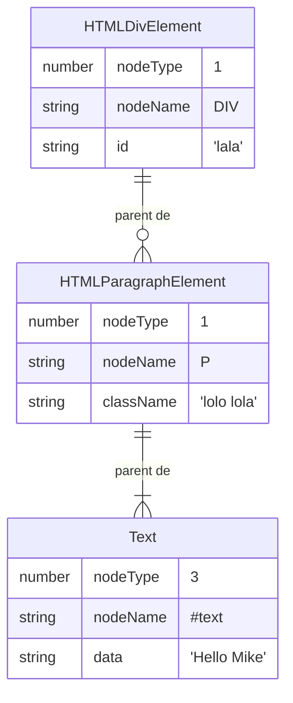

Bonjour.

Si tu te souviens du fonctionnement des classes en JavaScript, tu comprendras peut-être mieux ce concept.

En JavaScript, il existe des classes spécialement créées pour le Web afin de représenter tous les éléments présents dans
un document HTML. Concrètement, lorsque tu accèdes à une page, le navigateur lit le document HTML ligne par ligne et
crée des instances de ces classes pour chaque élément qu'il _analyse_.

Prenons un exemple avec ces éléments :

```html
<div id="lala">
	<p class="lolo lola">Hello Mike</p>
</div>
```

Le navigateur va _analyser_ le premier élément "`div`" et créera une instance de la classe
[`HTMLDivElement`](https://developer.mozilla.org/en-US/docs/Web/API/HTMLDivElement), qui est liée à la balise `div`.

> [!NOTE]
>
> _analyser_ ici veut dire qu'il va décortiquer chaque partie de l'élément et va les mettre dans les propriétés de la classe.
>
> Par exemple le nom de la balise (`div`), chaque attribut (`id` = `"lala"`, `class` = `lolo lola`...),
> et le contenu (`<p class="lolo lola">Hello Mike</p>`).

Ensuite il va _analyser_ le contenu de la "`div`", qui est un "`p`" (paragraphe), et va créer une instance de la classe
[`HTMLParagraphElement`](https://developer.mozilla.org/en-US/docs/Web/API/HTMLParagraphElement), qui est liée à la
balise `p`.

Ensuite il va analyser le texte `Hello Mike` et créer une instance de la classe
[`Text`](https://developer.mozilla.org/en-US/docs/Web/API/Text), et va l'ajouter aux enfants de l'instance de classe de
l'élément "`p`".

Il va ensuite ajouter l'instance de la classe de l'élément "`p`" aux enfants de l'instance de la classe de l'élément
"`div`".

Ce qui nous donne l'arbre **DOM** suivant:



En gros, ce code là est automatiquement crée pour nous afin de nous éviter de l'écrire nous-même:

> [!CAUTION]
>
> Le code ci-bas est INCORRECT, il est à titre d'exemple. Les vraies classes ont beaucoup plus de propriétés et de
> méthodes, et ont de l'heritage. Il ne faut pas prendre au pied de la lettre cette exemple.

```js
class HTMLDivElement {
	//...
	// beaucoup de propriétés et de méthodes,
	// parmi elles, il y a:
	//...
	nodeName = "DIV";
	nodeType = 1;
	id; // qui va contenir la VALEUR de l'attribut HTML id

	// Une méthode qui ajoute un enfant à la DIV.
	appendChild(child) {}
}

class HTMLParagraphElement {
	//...
	// beaucoup de propriétés et de méthodes,
	// parmi elles, il y a:
	//...
	nodeName = "P";
	nodeType = 1;
	className; // qui va contenir les classes de l'attribut HTML classes

	// Une méthode qui ajoute un enfant au paragraphe.
	appendChild(child) {}
}

class Text {
	//...
	// beaucoup de propriétés et de méthodes,
	// parmi elles, il y a:
	//...
	nodeValue = 3;
	nodeName = "#text";

	constructor(text) {
		this.data = text;
	}
}

let div = new HTMLDivElement();
div.id = "lala";

let paragraph = new HTMLParagraphElement();
paragraph.className = "lolo lola";
paragraph.appendChild(new Text("Hello Mike"));

div.appendChild(paragraph);
```

> [!CAUTION]
>
> Le code ci-haut est INCORRECT, il est à titre d'exemple. Les vraies classes ont beaucoup plus de propriétés et de
> méthodes, et ont de l'heritage. Il ne faut pas prendre au pied de la lettre cette exemple.

Imagine donc un peu avec un document HTML complet ce que ça pourrait donner.

```html
<!DOCTYPE html>
<html lang="en">
<head>
	<meta charset="UTF-8">
	<meta name="viewport" content="width=device-width, initial-scale=1.0">
	<title>Mon super titre</title>
</head>
<body>
	<div id="lala">
		<p class="lolo lola">Hello Mike</p>
	</div>
</body>
</html>
```

Il s'agit donc d'une représentation `OBJET` de notre document HTML. Une conversion de l'HTML vers le JavaScript.

Lorsque tu récupères un élément à l'aide des méthodes du
[`document`](https://developer.mozilla.org/en-US/docs/Web/API/Document), comme `getElementById` ou `querySelector`, ces
méthodes te donnent l'instance de classe que le navigateur a soigneusement créée pour représenter l'élément que tu as
demandé de cibler.

```js
let mon_element_div = document.getElementById("lala"); // HTMLDivElement
alert(mon_element_div.id); // équivaut à la valeur de l'attribut id de la div (= "lala")
```

Dans cet exemple, la variable `mon_element_div` contient maintenant l'instance de la classe `HTMLDivElement`. Grâce à
cette instance, tu as accès aux propriétés et méthodes de cette classe.

Si la liste de ces classes HTML t'intéressent, tu peux la consulter ici: https://developer.mozilla.org/en-US/docs/Web/API/HTML_DOM_API#html_element_interfaces_2
